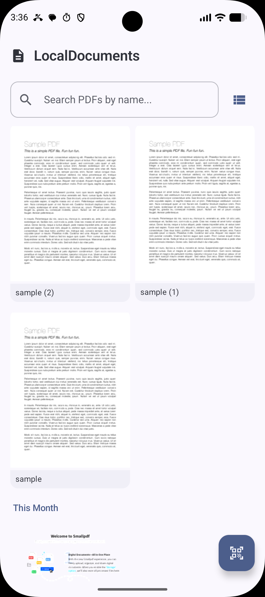
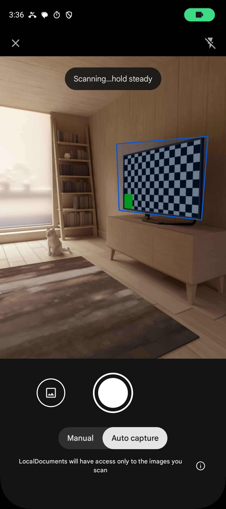
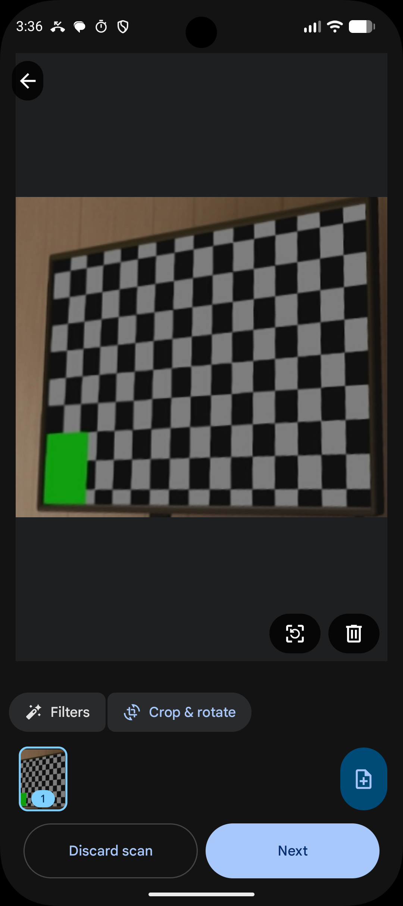

<div align="center">
  
  <h1>LocalDocuments</h1>
  <p><strong>On-device document scanner · Powered by ML Kit</strong></p>
  <p>
    <a href="#features"></a>
    <a href="#tech-stack"></a>
    <a href="https://kotlinlang.org"></a>
    <a href="https://developer.android.com/jetpack/compose"></a>
    <a href="LICENSE"></a>
    <a href="https://github.com/features/actions"></a>
  </p>
</div>

---

**LocalDocuments** is a fully offline, on-device document scanner for Android that uses **ML Kit Document Scanner API** to scan physical documents using your camera — no camera permission needed, no cloud calls, no internet required. The entire scanning, filtering, and processing pipeline runs on your device via Google Play Services.

---

## ✨ Features

- **📷 No Camera Permission Required** — Google Play Services handles camera access; your app never requests camera permission.
- **🤖 Automatic Capture** — Document detection enables automatic capture without tapping a button.
- **✂️ Accurate Edge Detection** — Automatically detects document edges for optimal cropping.
- **🔄 Auto-Rotation** — Detects document orientation and rotates scans upright.
- **🎨 Filters & Cleaning** — Apply grayscale, auto-enhance, remove shadows, erase stains and fingers (ML-powered).
- **📸 JPEG + PDF Output** — Get scanned pages as JPEG images and/or a multi-page PDF.
- **🖼️ Gallery Import** — Import existing photos to convert into scanned documents.
- **📄 Multi-Page Support** — Set a page limit and scan multi-page documents.
- **📤 Share PDF** — Export and share scanned documents as PDF via any app.
- **🎨 Material Design 3** — Modern UI with dynamic color (Material You) support.
- **📱 Jetpack Compose** — Declarative, reactive UI built entirely with Compose.
- **🌙 Dark Mode** — Automatic theme switching based on system settings.
- **🆓 Free & Open Source** — No subscriptions, no API costs, forever.

## 🖼️ Screenshots

| Scanner Settings | Scan Preview | Scan Result |
|:---:|:---:|:---:|
|  |  |  |

## 🛠️ Tech Stack

| Layer | Technology |
|---|---|
| **Language** | [Kotlin](https://kotlinlang.org) 2.0.21 |
| **UI Framework** | [Jetpack Compose](https://developer.android.com/jetpack/compose) with Material Design 3 |
| **Theming** | Dynamic Color (Material You) via `MaterialTheme.colorScheme` |
| **Architecture** | Single Activity + `ViewModel` + `StateFlow` |
| **Document Scanner** | [ML Kit Document Scanner API](https://developers.google.com/ml-kit/vision/doc-scanner) `16.0.0-beta1` |
| **Image Loading** | [Coil](https://coil-kt.github.io/coil/compose/) `2.7.0` |
| **Min SDK** | API 26 (Android 8.0) |
| **Target SDK** | API 35 (Android 15) |
| **Build System** | Gradle 8.12 + Android Gradle Plugin 8.7.3 |
| **CI/CD** | GitHub Actions — automated APK build & release |

## 📦 Installation

### Prerequisites

- Android device running Android 8.0+
- Google Play Services (included on most Android devices)
- Minimum 1.7GB RAM

### Download APK

1. Go to the [Releases](https://github.com/yourusername/localdocuments/releases) page.
2. Download the latest `app-debug.apk`.
3. Open it on your device to install.

### Build from Source

```bash
git clone https://github.com/yourusername/localdocuments.git
cd localdocuments
./gradlew assembleDebug
```

The APK will be at `app/build/outputs/apk/debug/app-debug.apk`.

## 🚀 Usage

1. Open **LocalDocuments** on your device.
2. Configure scanner settings (mode, gallery import, page limit) on the main screen.
3. Tap the **Scan** button (FAB) to launch the document scanner.
4. Point your camera at a document — detection is automatic.
5. Review the scan: crop, apply filters, remove stains, or clean shadows.
6. Return to the app to view scanned pages and share the PDF.

### Scanner Modes

| Mode | Description |
|------|-------------|
| **Full** | Full editing capabilities — crop, rotate, filters, ML-powered cleaning (stain/finger/shadow removal). Future features auto-added via Play Services updates. |
| **Base + Filter** | Basic editing (crop, rotate, reorder) plus image filters (grayscale, auto-enhance). |
| **Base** | Basic editing only — crop, rotate, and reorder pages. |

## 🤖 How It Works

```
┌────────────────────────────────────────────────────────┐
│                    Your Android Device                    │
│                                                          │
│  ┌──────────────┐     ┌──────────────────────────────┐  │
│  │LocalDocuments │────▶│  GmsDocumentScanning API     │  │
│  │ (Compose UI)  │◀────│  (ML Kit Document Scanner)  │  │
│  └──────────────┘     └───────────┬──────────────────┘  │
│                                   │                      │
│                          ┌────────▼──────────────────┐   │
│                          │  Google Play Services      │   │
│                          │  ├─ Camera & Viewfinder    │   │
│                          │  ├─ Edge Detection        │   │
│                          │  ├─ Auto-Rotation         │   │
│                          │  ├─ Image Filters         │   │
│                          │  ├─ ML Cleaning (Stains,  │   │
│                          │  │   Fingers, Shadows)    │   │
│                          │  └─ PDF Generation        │   │
│                          └───────────────────────────┘   │
│                                                          │
│  ─── No Camera Permission · No Internet · No Cloud ───  │
└────────────────────────────────────────────────────────┘
```

## 📱 Device Compatibility

### Requirements

- **Android API level 21+** (minSdk 26 recommended)
- **Minimum 1.7GB RAM** (returns `UNSUPPORTED` error if below)
- **Google Play Services** with ML Kit document scanner module

The document scanner UI flow, ML models, and resources are dynamically downloaded by Google Play Services. The models are cached after first use, so subsequent scans are faster.

## 🏗️ Project Structure

```
localdocuments/
├── app/
│   ├── src/main/
│   │   ├── java/com/localdocuments/app/
│   │   │   ├── MainActivity.kt          # Compose UI — settings, scan, results
│   │   │   ├── DocumentViewModel.kt     # Scanner state, settings, result handling
│   │   │   └── ui/theme/
│   │   │       ├── Theme.kt             # Material 3 theme (light/dark/dynamic)
│   │   │       ├── Color.kt             # Custom color definitions (teal)
│   │   │       └── Type.kt              # Typography scale
│   │   ├── AndroidManifest.xml
│   │   └── res/
│   │       ├── drawable/                # Launcher icon vectors
│   │       ├── xml/file_paths.xml       # FileProvider paths for PDF sharing
│   │       └── values/                  # strings, colors, themes
│   ├── build.gradle.kts
│   └── proguard-rules.pro
├── docs/
│   ├── icon.svg                         # App icon for landing page
│   └── index.html                       # Project landing page
├── screenshots/
│   ├── Screenshot_1782295592.png        # Scanner settings screen
│   ├── Screenshot_1782295598.png        # Scan preview screen
│   └── Screenshot_1782295618.png        # Scan result screen
├── .github/workflows/
│   └── release.yml                      # CI/CD pipeline for APK
├── build.gradle.kts                     # Root build config
├── settings.gradle.kts
├── gradle.properties
└── README.md
```

## 🤝 Contributing

Contributions are welcome! Here's how you can help:

1. Fork the repository.
2. Create a feature branch (`git checkout -b feature/amazing-feature`).
3. Commit your changes (`git commit -m 'Add amazing feature'`).
4. Push to the branch (`git push origin feature/amazing-feature`).
5. Open a Pull Request.

Please ensure your code follows the existing style and passes the build.

## 🚢 How to Release

Creating a new release is a **two-step** process:

### Step 1 — Bump the version

Edit `app/build.gradle.kts` and update the `versionName`:

```kotlin
defaultConfig {
    versionCode = 2          // increment for each release
    versionName = "1.1.0"    // update to the new version
}
```

### Step 2 — Commit with `#go`

Commit your changes with a message that **must contain `#go`** anywhere in the commit text:

```bash
git add .
git commit -m "feat: add multi-page crop support #go"
git push origin main
```

The CI/CD pipeline will automatically:
1. Detect `#go` in the commit message.
2. Read the version from `app/build.gradle.kts`.
3. Build the debug APK.
4. Create a Git tag (`v1.1.0`).
5. Publish a GitHub Release with the APK attached.

> **Note:** No keystore signing is required — the debug APK is released as-is. This is fine for open-source projects. Users install it as a debug build.

## 📄 License

This project is licensed under the **MIT License** — see the [LICENSE](LICENSE) file for details.

```
MIT License

Copyright (c) 2025 LocalDocuments Contributors

Permission is hereby granted, free of charge, to any person obtaining a copy
of this software and associated documentation files (the "Software"), to deal
in the Software without restriction, including without limitation the rights
to use, copy, modify, merge, publish, distribute, sublicense, and/or sell
copies of the Software, and to permit persons to whom the Software is
furnished to do so, subject to the following conditions:

The above copyright notice and this permission notice shall be included in all
copies or substantial portions of the Software.

THE SOFTWARE IS PROVIDED "AS IS", WITHOUT WARRANTY OF ANY KIND, EXPRESS OR
IMPLIED, INCLUDING BUT NOT LIMITED TO THE WARRANTIES OF MERCHANTABILITY,
FITNESS FOR A PARTICULAR PURPOSE AND NONINFRINGEMENT. IN NO EVENT SHALL THE
AUTHORS OR COPYRIGHT HOLDERS BE LIABLE FOR ANY CLAIM, DAMAGES OR OTHER
LIABILITY, WHETHER IN AN ACTION OF CONTRACT, TORT OR OTHERWISE, ARISING FROM,
OUT OF OR IN CONNECTION WITH THE SOFTWARE OR THE USE OR OTHER DEALINGS IN THE
SOFTWARE.
```
